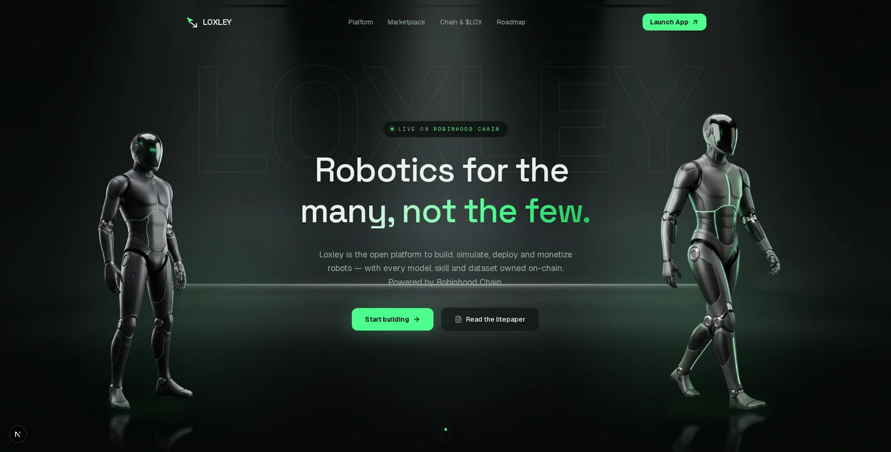

<div align="center">


# LOXLEY

**The people's robotics platform — on Robinhood Chain.**

*Robotics for the many, not the few.*

[](https://loxley.work)
[](https://github.com/LoxleyRobotics/loxley-sdk)
[](#)
[](#)

<br />



</div>

---

Loxley is an open platform where anyone can **build, simulate, deploy and monetize robots** — every model, skill and dataset owned on-chain, every reuse routing royalties back to its creators in `$LOX`. Think of it as the marketplace and toolchain for open robotics, settled on Robinhood Chain's 0.25s blocks.

This repo is the landing site: **[loxley.work](https://loxley.work)**.

## Highlights

- 🎬 **Cinematic layered hero** — product-reveal stage, twin robot cutouts with polished-floor reflections, giant outline watermark, dust particles; every layer on its own scroll + mouse parallax track
- 📌 **Pinned scroll story** — Build → Simulate → Deploy → Earn plays out over 400vh with a sticky scene and spring-smoothed crossfades
- 🃏 **Marketplace grid** — 3D tilt cards with per-column parallax drift, robots named after the Merry Men (WREN-2, TUCK-9, MARIAN…)
- 🌊 **Lenis smooth scrolling** with a scroll-progress bar and anchor offsets
- ⚡ Static export, zero console errors, single-page assembly

## Stack

| | |
| --- | --- |
| Framework | [Next.js 16](https://nextjs.org) — App Router, Turbopack |
| Styling | [Tailwind CSS v4](https://tailwindcss.com) — `@theme inline` design tokens |
| Animation | [Motion v12](https://motion.dev) — scroll/mouse parallax, springs, pinned scenes |
| Scrolling | [Lenis](https://lenis.darkroom.engineering) |
| Type | Space Grotesk · Geist · Geist Mono via `next/font` |
| Icons | [lucide-react](https://lucide.dev) |

## Development

```bash
pnpm install
pnpm dev      # http://localhost:3000
pnpm build    # production build
pnpm lint
```

## Structure

```
src/
  app/
    layout.tsx        # fonts, metadata, smooth-scroll provider
    page.tsx          # section assembly
    globals.css       # design tokens, keyframes (dark Sherwood-green theme)
    icon.svg          # arrowhead favicon
  components/
    primitives.tsx    # Reveal, WordReveal, Counter, GlowCard, TiltCard, Parallax, SectionHeader
    hero.tsx          # layered parallax scene (stage / watermark / robots / particles)
    how-it-works.tsx  # pinned 400vh scroll story
    navbar.tsx  ticker.tsx  bento.tsx  marketplace.tsx
    chain.tsx  roadmap.tsx  cta.tsx  footer.tsx  logo.tsx
  lib/utils.ts        # cn()
public/
  layers/             # stage, robot cutouts, drone (WebP, bg-removed)
  robots/             # marketplace card art
```

## Design tokens

Defined in `globals.css` (`@theme inline`): `night` (bg) · `panel` · `line` (borders) · `fog` (muted text) · `snow` (text) · `lox` (mint accent) · `lox-dim` · `lox-deep`. Use tokens, not raw hex.

## Ecosystem

- **[@loxley/sdk](https://github.com/LoxleyRobotics/loxley-sdk)** — TypeScript SDK: registry, marketplace, sim, OTA deploy, royalties, chain RPC

---

<div align="center">

**[loxley.work](https://loxley.work)** · [GitHub](https://github.com/LoxleyRobotics/loxley-sdk) · [X](https://x.com/LoxleyRobotics)

</div>
